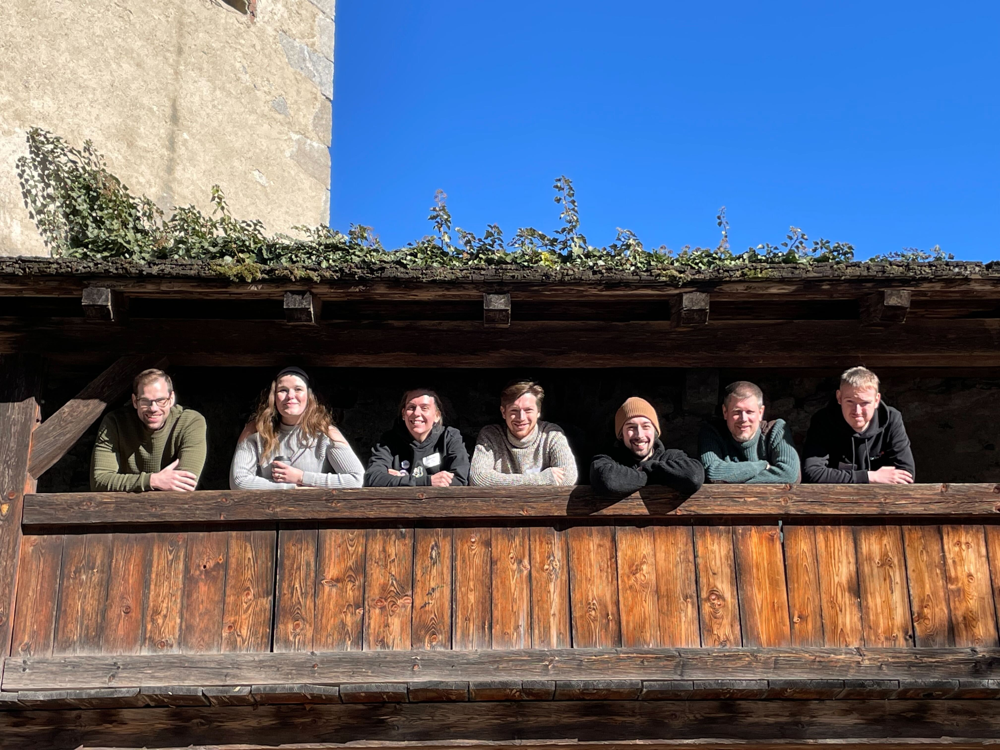

```{r style, echo = FALSE, results = 'asis'}
BiocStyle::markdown()
```

# Introduction

In this vignette, we will reanalyse single-cell proteomics data from
[@Ai2025].

## Motivation of the original paper

iPSC-derived cardiomyocytes (iCMs) have been proposed as a model to
study cardiovascular diseases. However, this requires that iCMs
display the same biological features as adult cardiomyocytes
(aCMs). The authors of the manuscript used MS-based single-cell
proteomics to analyze metabolic changes in iPSCs during
differentiation process and to compare the resulting iCMs to
freshly-isolated aCMs.

Here, we will focus on the analysis of the aCMs data.

## Data origin

Single cardiomyocytes were isolated from 3 human hearts using
enzymatic digestion isolation technique.

Cells were isolated from 4 regions of the heart:
- **LVepi**: left ventricle, epi-myocardium
- **LVendo**: left ventricle, endo-myocardium
- **LVmid**: left ventricle, mid-myocardium
- **RV**: right ventricle

Single cell proteomes were analyzed in a label-free approach. MS data
was acquired in data-independent mode (DIA-MS). Data were analyzed
with DIA-NN 1.8.1 and DIA-NN 1.8.2. The DIA-NN reports were downloaded
from MassIVE (MSV000094438).

#### Packages

The following packages were used to compile this vignette.

```{r setup, message = FALSE, warning = FALSE}
library(QFeatures)
library(scp)
library(tidyverse)
library(patchwork)
```

# Data prepartion

We can now read in the results file from DIA-NN. We use the file
`report.tsv` file generate by DIA-NN (renamed `aCMs_report.zip` below).

```{r readreport, eval = TRUE, cache = TRUE, message = FALSE}
acmsTab <- read_tsv("./data/aCMs_report.zip")
```

<!-- We can use the `readSCPfromDIANN` to have an initial look at the data. -->

<!-- ```{r readscp0, eval = FALSE} -->
<!-- acms <- readSCPfromDIANN(acmsTab) -->
<!-- acms -->
<!-- ``` -->

We need to extract metadata from the file names, in particular:
- File name
- Sample name
- Acquisition date
- Subject number
- Location in the heart from which each cell was extracted (see above)
- Position in the 384 well plate
- Position (BA18, ...)

Our goal is then to create a data frame with 299 rows, one for each
cell, with the information defined above as the columns.

```{r metadata}
## Extracting file name, sample name, date, subject, well position and
## position
tab <- tibble(File.Name = unique(acmsTab[[1]])) |>
    mutate(Sample = sub("^.+CM_PROJECT\\\\", "", File.Name)) |>
    mutate(Sample = sub("\\\\", "_", Sample)) |>
    mutate(Date = ymd(as.integer(substring(Sample, 1, 6)))) |>
    mutate(Subject = sub("^.+_(Subject[0-9])_.+$", "\\1", Sample)) |>
    mutate(PlateWell = sub("^.+_([A-Z][0-9]+)_.+$", "\\1", Sample)) |>
    mutate(PlateRow = gsub("[0-9]*", "", PlateWell)) |>
    mutate(PlateColumn = gsub("[A-Z]*", "", PlateWell)) |>
    mutate(PlateColumn = factor(PlateColumn, levels = 1:24)) |>
    mutate(Position = sub("^.+_([A-Z]+[0-9]+)_1_[0-9]+\\.d$", "\\1", Sample)) |>
    mutate(FileIndex = sub("^.+_1_([0-9]+)\\.d$", "\\1", Sample)) |>
    mutate(FileIndex = factor(FileIndex, levels = sort(unique(FileIndex))))

## Extracting the heart locations
tab$HeartLocation <- NA
ExpectedLocations <- c("Lvendo", "Lvepi", "Lvmid", "RV", "sytox")
for (i in 1:5) {
  loc <- ExpectedLocations[i]
  tab$HeartLocation[grep(loc, tab$File.Name, ignore.case = TRUE)] <- loc
}
```

```{r}
tab
```

After creating the data frame we can check that the values in the
different columns.

```{r tabtabs}
table(tab[, c("Date","Subject")])
table(tab[, c("HeartLocation","Subject")])
```

We can see that there are 21 cells from subject 5, annotated as
"sytox", acquired on one specific date. Sytox is a stain used for
assessing cell viability. We will therefore remove these cells before
we start doing statistical analysis.

To create the `QFeatures` object, we need to add a column `runCol` to
properly associate the `colData` to each sample.

```{r, eval = TRUE}
tab$runCol <- tab$File.Name
```

Now we can create the `QFeatures` object, and include the metadata
that we extracted. We also use the `fnames` argument^[Note that the
`fnames` requires `QFeatures` version 1.17.2 or later.] to use
percursor identifiers (i.e. peptides sequence and precursor charge) as
assay rownames (this is important to correctly join the assays below).

```{r readscp, eval = TRUE, cache = TRUE}
acms <- readSCPfromDIANN(acmsTab,
                         colData = DataFrame(tab),
                         fnames = "Precursor.Id")
# Setting the names of the QFeatures objects
names(acms) <- acms$Sample
acms
```

The `QFeatures` object contains `r length(acms)` assays, on per single
cell.


```{r checkversion, echo = FALSE}
stopifnot(packageVersion("QFeatures") >= "1.17.2")
```

We immediately replace 0 by `NA` for downstream analysis.

```{r naIsZero, eval = TRUE, cache = TRUE}
acms <- zeroIsNA(acms, names(acms))
```

# Exploratory data analysis and quality control

The objective of quality control is to remove low-quality data. These
data can be filtered based on PSM-level annotations and on cell-level
annotations.

## PSM filtering

We first explore the features annotation. We can retrieve all the data
annotations along the quantified values in a single long table using
`longFormat()`

```{r longform, cache = TRUE}
lf <- longFormat(acms,
                 colvars = c("HeartLocation", "Subject", "FileIndex"),
                 rowvars = c("PEP", "RT", "Predicted.RT", "IM", "Predicted.IM")) |>
    data.frame()
```

We first explore the distributions of the posterior error
probabilities (PEP) for precursor identification for each cell
separately, stratified by subject, a potential variable for batch
effects. We sort the cells according to the sequence of MS acquisition
(available in the `FileIndex` column).

```{r, fig.height = 10, fig.wide = TRUE}
ggplot(lf) +
    aes(x = log10(PEP),
        y = FileIndex,
        colour = Subject) +
    geom_boxplot() +
    theme(axis.text.y = element_blank(),
          axis.ticks.y = element_blank())
```

The plot indicates that the identification errors of every precursor
are stable across the experiment. We will therefore not use PEP for
PSM filtering.

We now generate a similar plot, but focusing on the difference between
the observed retention time (RT) and the predicted RT, where large
differences may indicate wrong identification or issues during liquid
chromatography. We hence plot the absolute difference between observed
RT.

```{r, fig.height = 10, fig.wide = TRUE}
ggplot(lf,
       aes(x = abs(RT - Predicted.RT),
           y = FileIndex,
           colour = Subject)) +
    geom_boxplot() +
    geom_hline(yintercept = 0.18, linetype = "dashed") +
    scale_x_log10() +
    theme(axis.text.y = element_blank(),
          axis.ticks.y = element_blank())
```

Again, the plot shows stable metrics across cells, with a few outliers
above 0.18 spread across the experiment. We will remove those outliers
using `filterFeatures()` that takes the `QFeatures` object and an
arbitrary formula to filter the PSM. Note that you can directly filter
on variables from the rowData by including them in the formula.

```{r filterRT}
acms <- filterFeatures(acms, ~ abs(RT - Predicted.RT) < 0.18)
```

Next, we remove precursors that map on multiple proteins, as these are
of limited use when interpreting downstream, we will remove them.
DIA-NN generated the `isProteotypic`, however the table below shows
that some precursors considered as proteotypic may still be part of a
protein group where the `Protein.Ids` contain multiple proteins
separated by a `;`.

```{r rd, cache = TRUE}
rd <- rbindRowData(acms, names(acms))
table(isProteotypic = rd$Proteotypic,
       isProteinGroup = grepl(";", rd$Protein.Ids))
```

We here keep all precursor that are both proteotypic and not part of a
protein group.

```{r filterProt}
acms <- filterFeatures(acms,
                       ~ !grepl(";", Protein.Names) &
                           Proteotypic == 1)
```

Finally, we add the information whether a precursor belongs to a
contaminant protein or not. We retrieve this information using the
cRAP database, through the `camprotR` package.

```{r crap, warning = FALSE}
head(contaminants <- camprotR::get_ccp_crap())
```

We next retrieve all the rowData table in a single table using
`rbindRowData()`, we add a new column `isContaminant` and inject it
back into the `QFeatures` object after splitting it by assay.

```{r contsInRd, cache = TRUE}
rd <- rbindRowData(acms, names(acms))
rd$isContaminant <- rd$Protein.Ids %in% contaminants
rowData(acms) <- split(rd, rd$assay)
```

We decide not to remove contaminants as they may be used later for
model exploration and diagnostics.

## Sample filtering

We now remove low-quality cells. We will compute a few metrics,
explore the experimental design and assess how it impacts the computed
metrics and we will conclude with removing cells identified as
low-quality, if any.

### Compute QC metrics

First, we compute the median intensity within each cell. This is meant
as a proxy for the amount of material that has been injected in the
MS. Note that in single-cell experiments, difference in the amount of
material injected are subject to technical variability, but also to
biological variability (cell size, proteome complexity, cell
density, ...). Hence, different median intensities may not be a
problematic artifact if different across heart location.

```{r medint}
acms$MedianIntensity <- sapply(names(acms), function(i) {
    median(log2(assay(acms[[i]])), na.rm = TRUE)
})
```

We also compute the number of identified precursors within each cell.
This relates to the number of rows in each set of the `QFeatures`
object.

```{r totids}
acms$TotalIds <- nrows(acms)
```

### Explore the experimental design

We now explore the experimental design. First, the sample annotation
contain subjects and different dates. The table below shows that each
subject has been processed in a different day.

```{r}
table(acms$Date, acms$Subject)
```

This is not a problematic design as soon we are not interested in
distinguishing between subject effects and date effects, which is the
case for this experiment.

Next we will explore the plate design. We first retrieve all the
available sample annotations from the `colData` and perform a little
data cleaning for improved visualisation.

We will first explore how the data acquisition strategy, by plotting
the order of the the MS runs on the plate layout.

```{r, fig.width=10, fig.wide = TRUE}
data.frame(colData(acms)) |>
    ggplot(aes(y = PlateRow,
               x = PlateColumn,
               fill = as.numeric(FileIndex))) +
    geom_tile() +
    facet_grid(~ Date) +
    scale_fill_continuous(type = "viridis") +
    theme_minimal() +
    theme(axis.text.x = element_text(angle = 90, hjust = 1),
          legend.position = "bottom")
```

We can see that each plate as been acquired sequentially (as already
suggested by the date annotation), in order of the rows. Next, we now
plot the plate layout with respect to the heart location of the cells,
for each data/subject separately.

```{r, fig.width=10, fig.wide = TRUE}
data.frame(colData(acms)) |>
    ggplot(aes(y = PlateRow,
               x = PlateColumn,
               fill = HeartLocation)) +
    geom_tile() +
    facet_grid(~ Date) +
    theme_minimal() +
    theme(axis.text.x = element_text(angle = 90, hjust = 1),
          legend.position = "bottom")
```

Two observations can be drawn from the plot. First, all `sytox` cells
are from one date and hence their effect cannot be estimated.
According to the original study, this sample preparation for this
subject failed. Hence we will remove the corresponding data later.
Also cells have been assigned in block on the plate, one block for
each heart location. While this is probably the consequence of
practical constraints, this means we can no longer distinguish between
well column effect (if any) and heart location effects. Hence, we will
ignore cell column effects.

We plot the same layout, this time colouring by the number of
precursors identified.

```{r, fig.width=10, fig.wide = TRUE}
data.frame(colData(acms)) |>
    ggplot(aes(y = PlateRow,
               x = PlateColumn,
               fill = TotalIds)) +
    geom_tile() +
    facet_grid(~ Date) +
    scale_fill_continuous(type = "viridis") +
    theme_minimal() +
    theme(axis.text.x = element_text(angle = 90, hjust = 1),
          legend.position = "bottom")
```

Columns 10-24 in the first plate seem to have more identified
precursors than the other columns, potentially indicating some batch
effect during cell sorting. A cell type effect may also be an
explanation, but we do not see the effect in the last plate.

```{r, fig.width=10, fig.wide = TRUE}
data.frame(colData(acms)) |>
    ggplot(aes(y = PlateRow,
               x = PlateColumn,
               fill = MedianIntensity)) +
    geom_tile() +
    facet_grid(~ Date) +
    scale_fill_continuous(type = "viridis") +
    theme_minimal() +
    theme(axis.text.x = element_text(angle = 90, hjust = 1),
          legend.position = "bottom")
```

Interestingly, this plot shows that columns 1-9 in the first plate
have lower median intensity. We now combine the information

```{r, fig.wide = TRUE}
data.frame(colData(acms)) |>
ggplot(aes(y = MedianIntensity,
           x = TotalIds,
           colour = as.numeric(FileIndex),
           shape = Subject)) +
    geom_point(size = 2) +
    scale_colour_continuous(type = "viridis")
```

### Filter samples

Upon data exploration, we identified that one of the subjects should
be removed.

# Data processing

We now join the 299 single-cell assays into one containing all
precursors across all cells.

```{r joinPrecursors, cache = TRUE}
(acms <- joinAssays(acms, i = names(acms), name = "precursors"))
```

We then log-transforming our data for downstream statistical
analyses. The `logTransfrorm()` function will create a new assay,
named `precursors_log`.

```{r logtrans}
(acms <- logTransform(acms, "precursors", "precursors_log"))
```

While we will be performing our analyses with precursor data, below we
show how to aggregate these data into peptide and protein data.

```{r aggregation1, eval = TRUE}
acms <- aggregateFeatures(acms,
                          i = "precursors_log",
                          name = "peptides",
                          fcol = "Modified.Sequence",
                          fun = colMedians,
                          na.rm = TRUE)
```


```{r aggregation2, eval = TRUE}
acms <- aggregateFeatures(acms,
                          i = "peptides",
                          name = "proteins",
                          fcol = "Protein.Ids",
                          fun = colMedians,
                          na.rm = TRUE)
```

We now have two additional assays names `peptides` and `proteins`:

```{r}
acms
```

# Statistical modelling

We will model the data following the *scplainer* pipeline
[@Vanderaa2023-scplainer].

## Modelling

We extract the log-transformed precursor assez and remove sytox cells
(all from subject 5):

```{r sce}
sce <- getWithColData(acms, "precursors_log")
sce <- sce[, sce$HeartLocation != "sytox"]
```

We can now model the precursor quantities considering median intensity
in each cell, plate position (column), subject and heart location as
factors that influence the measure abundances.


```{r scpmodelling, cache = TRUE, message = FALSE}
sce <- scpModelWorkflow(
    sce,
    formula = ~ 1 + ## intercept
        ## normalisation
        MedianIntensity +
        ## batch effects
        PlateRow +
        Subject +
        ## biological variability
        HeartLocation,
    verbose = FALSE)

```

Note that above, we set the `verbose` argument to `FALSE` to switch
the progress bar out and avoid unnecessary output in this
vignette. For interactive use, we recommend to keep the default
(`verbose = TRUE`) to monitor progress.

Here, we define the missing data filtering threshold: we want at least
3 measurement for each coefficient estimation.

```{r filterthreshold}
scpModelFilterThreshold(sce) <- 3
scpModelFilterPlot(sce)
```

## Analysis of variance

```{r vaRes, cache = TRUE}
(vaRes <- scpVarianceAnalysis(sce))

## Add annotations from the rowData()
vaRes <- scpAnnotateResults(
    vaRes, rowData(sce), by = "feature", by2 = "Precursor.Id"
)
```

```{r vaPlot1}
scpVariancePlot(vaRes)
```

```{r vaPlot2, fig.height = 10, fig.wide = TRUE}
scpVariancePlot(
    vaRes, top = 20, by = "percentExplainedVar", effect = "Subject",
    decreasing = TRUE, combined = FALSE, fcol = "Protein.Names"
) + scpVariancePlot(
        vaRes, top = 10, by = "percentExplainedVar", effect = "HeartLocation",
        decreasing = TRUE, combined = FALSE, fcol = "Protein.Names"
    ) + plot_layout(ncol = 1, guides = "collect")
```


## Differential abundance analysis

```{r daRes, cache = TRUE}
locations <- unique(sce$HeartLocation)
combinations <- combn(locations, 2)
contrasts <- lapply(1:ncol(combinations),
                    function(i) c("HeartLocation",
                                  combinations[, i]))

(daRes <- scpDifferentialAnalysis(
     sce, contrast = contrasts
 ))
```

```{r daplots}
daRes[[1]]

daRes <-
    scpAnnotateResults(
        daRes, rowData(sce),
        by = "feature", by2 = "Precursor.Id")

scpVolcanoPlot(daRes,
               textBy = "Protein.Names",
               pointParams = list(aes(colour = Lib.Q.Value)))[[1]]
```

## Component analysis

```{r caRes, cache = TRUE}
(caRes <- scpComponentAnalysis(
     sce, ncomp = 15, method = "APCA"))
```

```{r caPlot, fig.wide = TRUE}
caResCells <- caRes$bySample
sce$cell <- colnames(sce)
caResCells <- scpAnnotateResults(caResCells,
                                 colData(sce), by = "cell")


scpComponentPlot(
    caResCells,
    pointParams = list(aes(colour = HeartLocation,
                           shape = Subject),
                       size = 3)) |>
    wrap_plots() +
    plot_layout(guides = "collect")
```

```{r tsne, fig.wide = TRUE}
library(scater)

sce <-addReducedDims(sce, caRes$bySample)
sce <- runTSNE(sce, dimred = "APCA_HeartLocation")

plotTSNE(sce, colour_by = "HeartLocation") +
    plotTSNE(sce, colour_by = "Subject") +
    plotTSNE(sce, colour_by = "PlateRow") +
    plotTSNE(sce, colour_by = "MedianIntensity")
```

We can not extract the hear location effect matrix, removing the
subject, plate position and median intensity effects for downstream
analysis.

```{r scebr}
scebr <- scpRemoveBatchEffect(
  sce, effects = c("Subject", "PlateRow", "MedianIntensity"),
  intercept = TRUE)
```

# Downstream analyses

Coming soon.

# Session information

This vignette was prepared as part of the [EuBIC 2025 developer
hackathon](https://eubic-ms.org/events/2025-developers-meeting/).

```{r hackathon, echo = FALSE, caption = "Hackathon participants, from left to right: Sven Berres, Hannah Voß, Louise Buur, Sam van Puyenbroeck, Christophe Vanderaa, Laurent Gatto and Enrico Massignani"}

```

using the follwing software

```{r si, echo = FALSE}
sessionInfo()
```

# References {-}